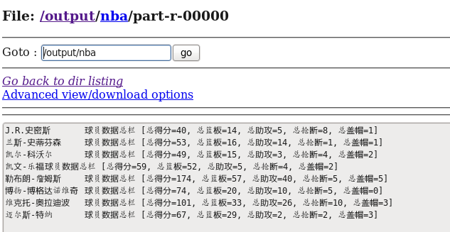

# MapReduce编程-统计球员五项数据
目录结构：

**Demo** 文件夹中是整个程序的源码，Demo.jar 是项目导出的 jar 包。

**球员数据** 文件夹是用作统计的数据源。

基于 Hadoop 平台，使用 MapReduce 编程，统计NBA球员五项数据，分别是得分、篮板、助攻、抢断、盖帽。

搭建大数据环境，个人博客链接：[在CentOS中搭建Hadoop ](https://wenshixin.gitee.io/blog/2018/03/27/%E5%9C%A8CentOS%E4%B8%AD%E6%90%AD%E5%BB%BAHadoop/)

搭建 MapReduce 的编程环境，个人博客链接：[在CentOS中安装Eclipse和MapReduce编程 ](https://wenshixin.gitee.io/blog/2018/04/12/%E5%9C%A8CentOS%E4%B8%AD%E5%AE%89%E8%A3%85Eclipse%E5%92%8CMapReduce%E7%BC%96%E7%A8%8B/)

球员数据上传到 HDFS 中，HDFS 相关个人博客链接：[HDFS基本命令 ](https://wenshixin.gitee.io/blog/2018/04/02/HDFS%E5%9F%BA%E6%9C%AC%E5%91%BD%E4%BB%A4/)

统计结果如下：

